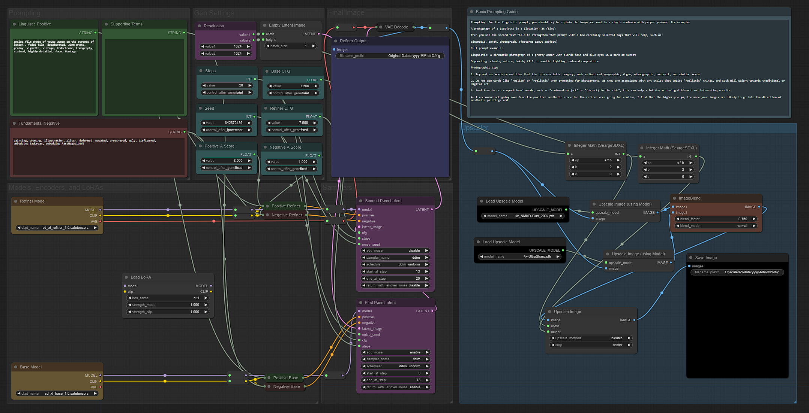
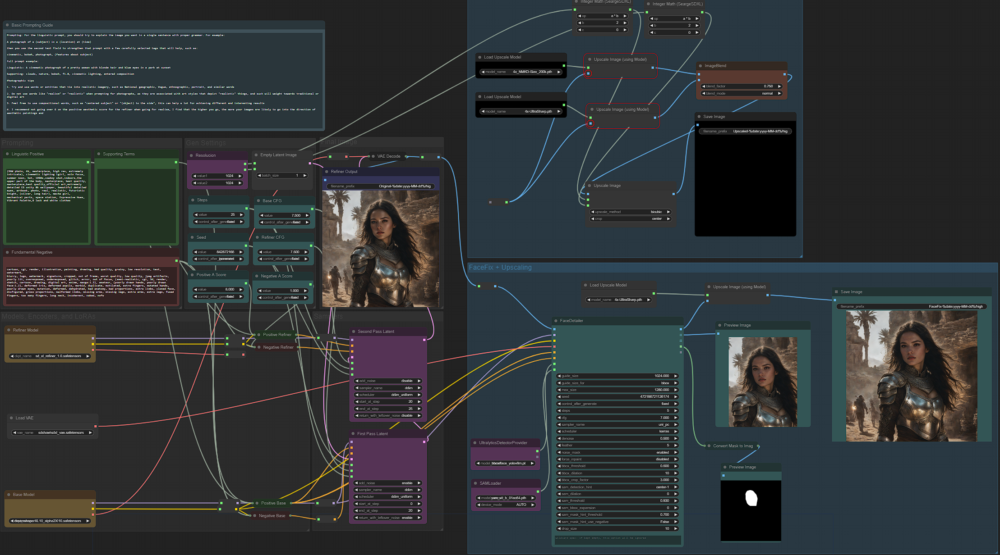

# Comfy-Workflow-sdxl
 Workflow for ComfyUI and SDXL 1.0

 

## About

- Workflow based on Sytan SD (https://github.com/SytanSD/Sytan-SDXL-ComfyUI)
- Upscaling from Searge SDXL (https://github.com/SeargeDP/SeargeSDXL)
- You need to import Searge SDXL modules
- Upscaling to 2048px

## Versions

- 1.1 Workflow for Base+Refiner and Upscaling
- 1.2 Workflow for Base+Refiner+VAE, FaceFix and Upscaling 4K

## Installation

1. Download the .json file from this repository.
2. Open ComfyUI and navigate to the "Clear" button.
3. Navigate to the "Load" button.
4. Select the downloaded .json file to import the workflow.

## Models

Use ComfyUI Manager and install all models you need

### Checkpoints (copy to ComfyUI/models/checkpoints)
- SDXL 1.0 Base (https://huggingface.co/stabilityai/stable-diffusion-xl-base-1.0/resolve/main/sd_xl_base_1.0.safetensors)
- SDLX 1.0 Refiner (https://huggingface.co/stabilityai/stable-diffusion-xl-refiner-1.0/resolve/main/sd_xl_refiner_1.0.safetensors)

### Upscale (copy to ComfyUI/models/upscale_models)
- SDXL 1.0 Base (https://huggingface.co/stabilityai/stable-diffusion-xl-base-1.0/resolve/main/sd_xl_base_1.0.safetensors)
- 4x_NMKD-Siax_200k.pth upscaler (https://huggingface.co/uwg/upscaler/resolve/main/ESRGAN/4x_NMKD-Siax_200k.pth)
- 4x-Ultrasharp.pth upscaler (https://huggingface.co/uwg/upscaler/resolve/main/ESRGAN/4x-UltraSharp.pth)

## License

Distributed under the GNU General Public License v3.0. See `LICENSE` for more information.
